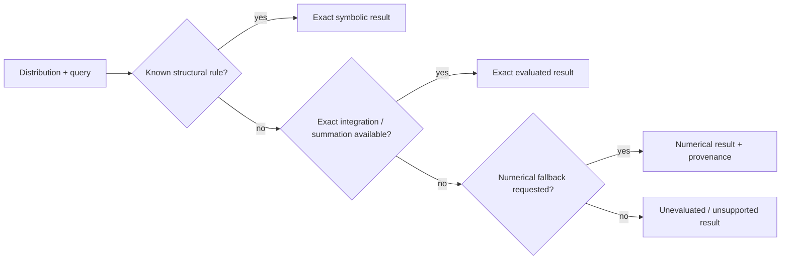
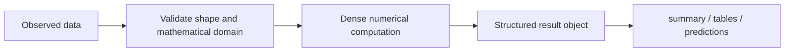
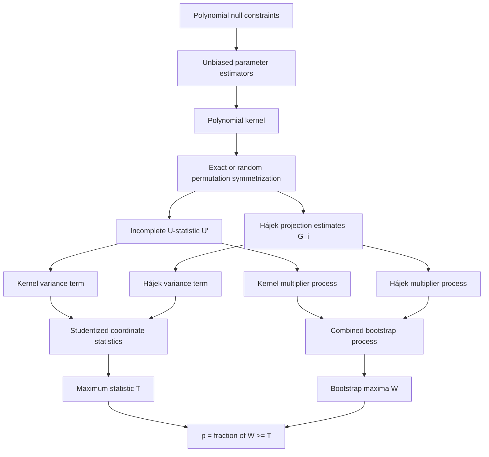
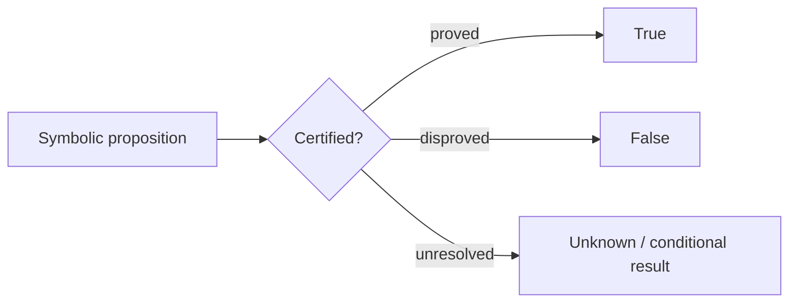

# Choosing a probstats workflow

`probstats` is most useful when exact mathematical structure and numerical statistics need to stay connected. Start from the kind of problem you have rather than from the module list.

| Goal | Start with | What probstats adds |
| --- | --- | --- |
| Work with a known probability law | `probstats` distributions and probability functions | Exact support, parameter constraints, moments, transforms, probability and expectation |
| Analyze observed data | `probstats.stats`, `probstats.data`, `probstats.smoothing` | Structured results, labeled-data support, resampling and regression |
| Fit a Bayesian model | `probstats.bayes` | Conjugacy, MCMC/VI utilities, diagnostics and posterior summaries |
| Manipulate random variables symbolically | `probstats.RandomVariable` and `probstats.symbolic` | Distribution algebra, assumptions, transforms and exact identities |
| Test polynomial constraints on model parameters | `probstats.algebraic.testing` | Unbiased polynomial kernels, incomplete U-statistics, SDL studentization and bootstrap |
| Need a proof-oriented exact decision | exact/certification APIs | Three-valued outcomes distinguish proof, disproof and unresolved cases |

## How calculations flow

For an ordinary distribution calculation, the package tries structure before generic numerical work:

This ordering matters: a numerical approximation does not silently replace an unresolved symbolic question.

For observed-data inference the flow is different:

Pandas labels, when present, are captured at the boundary and restored to results rather than used as the numerical compute engine.

## Semialgebraic testing workflow

A semialgebraic null starts with polynomial constraints on parameters. Parameter estimators turn those constraints into an unbiased kernel; the SDL procedure then uses a randomized incomplete U-statistic and a Gaussian multiplier bootstrap.

See [Semialgebraic hypothesis testing](algebraic-testing.md) for the mathematical details and API.

## Exact, numerical, and unresolved results

A recurring design rule is that “not proved” is not the same as “false.” Proof-oriented symbolic predicates therefore have three logical outcomes:

Use the [failure-semantics guide](failure-semantics.md) when writing code that must distinguish unsupported operations, unresolved mathematics, numerical failure, and invalid input.
